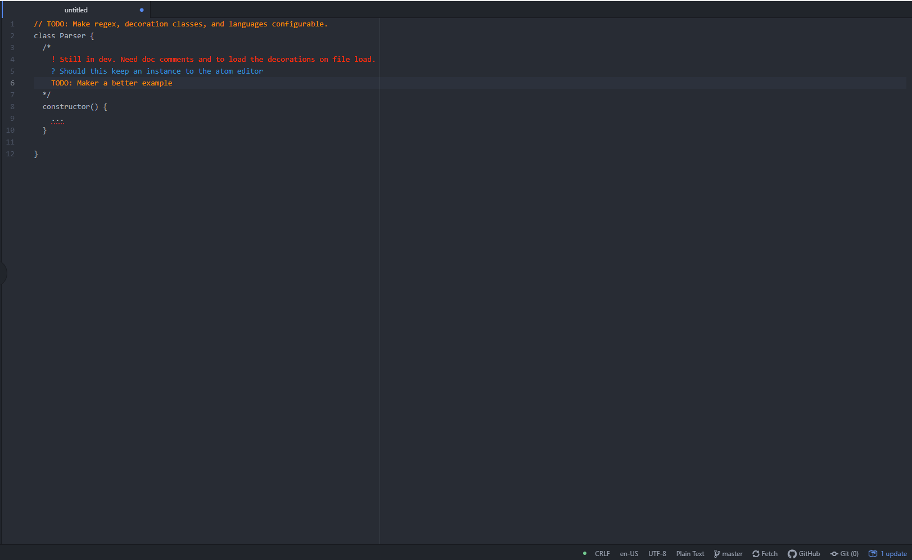

# atom-better-comments

Atom Better Comments plugin will help you create more human-friendly comments in your code. The plugin is meant to do highlighting (add decorations), of file comments automatically. The
The plugin is influenced by [better-comments](https://github.com/aaron-bond/better-comments), but is not a fork.

## Usage

These are the current commands.

| Name   | Description                     |
| ------ | ------------------------------- |
| format | Highlight comments in document. |

## Config

### Settings

Settings for the plugin are set in the package schema json, loacted in the `/lib` folder. Currently the tag keywords, to be highlighted, are located in this file.

### Tag Keywords

| Tag  | Class           | Type |
| ---- | --------------- | ---- |
| !    | alert-class     | line |
| ?    | question-class  | line |
| todo | todo-class      | line |
| \*   | highlight-class | line |

## Todo

- [ ] Fill out readme.
- [x] Find & Decorate comments in file.
  - [x] Fine single line comments.
  - [x] Fine block line comments.
  - [x] Fine document line comments.
- [ ] Decoration on file load.
  - [x] Change regex on language-code.
- [ ] Language support
  - [ ] Load language-code on file load.
  - [x] Ability to load language-code.
- [ ] Testing.
